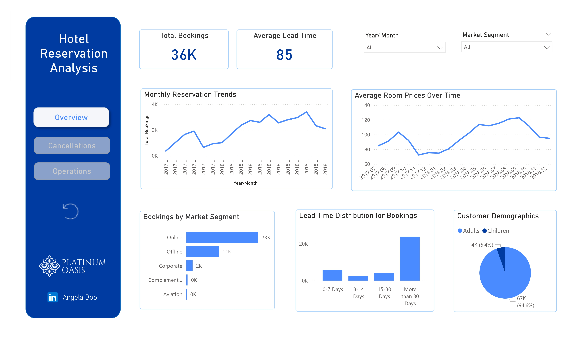
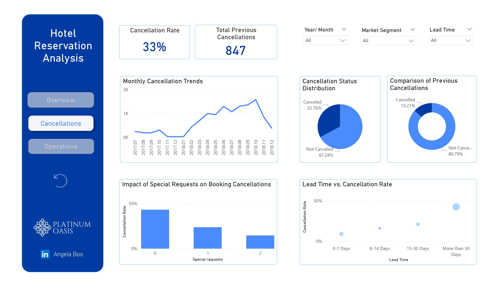
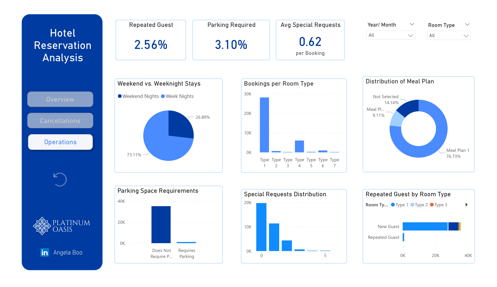

# Hotel Reservation Analysis Dashboard

## Introduction
This project presents an interactive **Power BI dashboard** designed to analyze hotel reservation data for **Platinum Oasis Hotel**. The dashboard was built using the **Hotel.csv dataset from Kaggle** and aims to uncover patterns in booking behavior, cancellations, and operational metrics.

By transforming raw reservation data into visual insights, the dashboard supports **data-driven decision-making in the hospitality industry**, helping hotel management optimize operations and improve guest experience.

---

## Power BI Dashboard Overview

The dashboard is organized into three analytical pages that provide different operational perspectives.

### 1. Overview Page
This page presents high-level metrics that summarize booking activity.

**Key insights include:**
- Total number of bookings
- Average lead time between booking and arrival
- Monthly reservation trends
- Distribution of bookings across market segments

These metrics help management quickly understand **overall demand patterns and booking behavior**.

### Overview Page

---

### 2. Cancellations Page
This section focuses on analyzing cancellation patterns and identifying factors that influence them.

**Key analyses include:**
- Cancellation rates by booking segment
- Impact of **special requests** on booking outcomes
- Relationship between **lead time and cancellation probability**
- Trends in cancellations across time periods

Understanding these patterns enables hotels to **develop strategies to minimize revenue loss from cancellations**.

### Cancellations Page

---

### 3. Operational Insights Page
This page highlights guest preferences and operational utilization metrics.

**Key insights include:**
- Most frequently booked **room types**
- Popular **meal plan selections**
- **Parking space utilization**
- Behavior of **repeated vs new guests**

These insights help the hotel align its services with **customer preferences and operational demand**.

### Operational Insights Page

---

## Dataset Details

**Source:** Kaggle – *Hotel.csv dataset*

The dataset contains **19 columns** describing hotel reservation details. Key variables used in this analysis include:

| Column | Description |
|------|------|
| **lead_time** | Number of days between booking and guest arrival |
| **status** | Indicates whether the reservation was canceled or completed |
| **market_segment** | Source of the booking (Online, Offline, Corporate, etc.) |
| **room_type** | Category of room reserved |
| **special_requests** | Number of special requests made by guests |
| **repeated_guest** | Indicates returning customers (1) or new customers (0) |

These variables were used to identify trends in **customer behavior, demand patterns, and operational efficiency**.

---

## Key Findings

The analysis reveals several important patterns:

- **Longer lead times** tend to correlate with higher cancellation rates.
- **Online bookings** represent a significant portion of reservations.
- **Specific room types** show higher demand, indicating areas where inventory planning can be optimized.
- **Returning guests** represent an opportunity for targeted loyalty programs.
- **Parking utilization** appears lower than expected, suggesting possible resource underuse.

---

## Conclusion

The dashboard provides actionable insights that can help **Platinum Oasis Hotel** improve operational performance.

### 1. Reduce Cancellations
- Implement flexible booking policies.
- Improve management of special requests to increase booking commitment.

### 2. Optimize Operations
- Focus resources on high-demand room types and meal plans.
- Reassess parking capacity and usage.

### 3. Enhance Customer Retention
- Develop loyalty programs for returning guests.
- Offer personalized promotions based on guest behavior.

By leveraging these insights, the hotel can **improve guest satisfaction, reduce revenue loss from cancellations, and drive sustainable business growth**.
